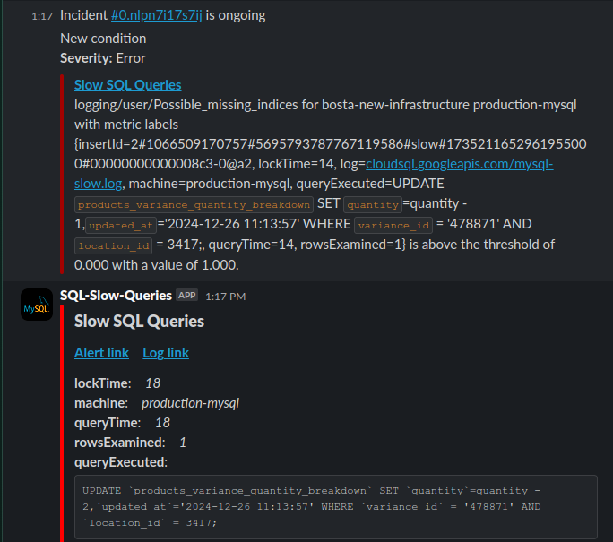

# GCP Alerts Formatter for Slack

## Overview

This project is designed to enhance the visibility of Google Cloud Platform (GCP) alerts by formatting them before sending them to Slack. The application parses the incoming alerts, structures them into an easily readable format, and appends useful links to relevant logs, enabling teams to take quick and informed actions.

## Core Functionality

The application processes alerts sent from GCP monitoring and applies policy-specific formatting before relaying them to Slack.

### Key Steps in the Workflow

1. **Receive GCP Alert Payload**:
   - Alerts are sent from GCP as HTTP POST requests.
   - Each payload contains details such as `policy_name`, `incident`, and `metric.labels`.

2. **Policy-Based Formatting**:
   - The middleware identifies the `policy_name` from the payload.
   - For example:
     - If `policy_name` is `SLOW_SQL_QUERIES`, the payload is processed using the `slowSqlQueriesMiddleWare` method.
     - Other policies are handled using a default formatter.

3. **Log Enrichment**:
   - Extracts relevant labels (e.g., `insertId`) from the alert payload.
   - Constructs Google Cloud Console links to logs for further investigation.
   - Example log link format:
     ```
     https://console.cloud.google.com/logs/query;query=insertId%3D%22<encodedInsertId>%22?project=<your-project-id>
     ```

4. **Slack Integration**:
   - Uses the Slack API to send formatted messages.
   - Messages include:
     - A **header** with the policy name.
     - A **section** with hyperlinks to alerts and logs.

## Project Highlights

- **Dynamic Formatting**:
  - The system tailors Slack messages to the type of alert.
  - This ensures that each message is concise, actionable, and easy to understand.

- **Link Integration**:
  - Quick access to relevant logs in GCP for immediate debugging.
  - Direct links reduce time spent navigating the console.

- **Error Handling**:
  - Includes robust error-handling mechanisms to ensure smooth operation and clear feedback in case of failures.

## Code Overview

### `api.js`
- Entry point of the application.
- Configures the Express server and routes.
- Uses `serverless-http` to enable deployment as a serverless application.

### `middleware.js`
- Defines the middleware function `alertsFormatter`.
- Routes the payload to appropriate service methods based on `policy_name`.

### `services.js`
- Implements the core logic for alert formatting.
- Enriches messages with log links and policy-specific formatting.
- Sends the final formatted message to Slack using helper methods.

## Example Slack Message before and after applying format:


