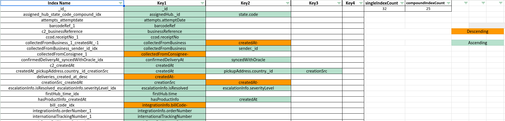

# MongoDB Index Visualization Guide

## Overview

This project provides a streamlined approach for visualizing MongoDB indices in a Google Sheets document. By leveraging a Colab Notebook and Google Sheets, you can analyze and document MongoDB indices with enhanced visibility, formatting, and organization.

## Steps to Visualize MongoDB Indices

### 1. Set Up the Spreadsheet
1. Duplicate the provided empty Google Sheet template to maintain consistent formatting, borders, and styles.
2. Locate the `SpreadSheetId` from the Google Sheet's URL:
   ```
   https://docs.google.com/spreadsheets/d/<SpreadSheetId>/edit
   ```

### 2. Configure the SubSheet for the Collection
1. Duplicate the first subSheet (e.g., "Sheet1").
2. Rename the duplicated sheet to match the MongoDB collection name (e.g., `deliveries`, `businesses`).

### 3. Open the Colab Notebook
1. Launch the accompanying Colab Notebook.

### 4. Assign Sheet Variables
1. Replace the `SPREADSHEET_ID` variable in the notebook's first cell with the `SpreadSheetId` from **Step 1**.
2. Update the `subSheetName` variable with the new sheet name from **Step 2**.

### 5. Fetch MongoDB Indices
1. Run the following query in your MongoDB shell or script:
   ```javascript
   const arr = db["deliveries"].getIndexes();
   const keys = {};
   arr.forEach(elem => { keys[elem.name] = elem.key; });
   const stringifiedIndices = JSON.stringify(keys);
   stringifiedIndices;
   ```
2. Copy the resulting JSON string.

### 6. Create the Indices File
1. In the Colab Notebook, execute the cell labeled **“Create Indices file”**.
2. A file named `indices.json` will be created in the notebook sidebar.
3. Open the file, paste the copied JSON string from **Step 5**, save, and close it.

### 7. Update the Google Sheet
1. Run the remaining cells in the Colab Notebook.
2. Authenticate your Google account when prompted to allow updates to the sheet.

### Reuse for Another Collection
- If you want to visualize indices for another collection within the same spreadsheet:
  1. Skip **Steps 1** and **2**.
  2. Duplicate the first empty subSheet/page.
  3. Proceed directly from **Step 3**.

<div style="page-break-after: always; visibility: hidden">
---
</div>
## A result sample:


